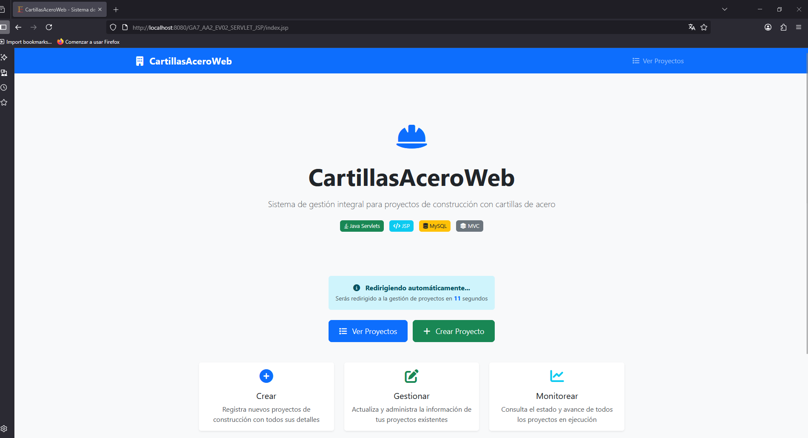
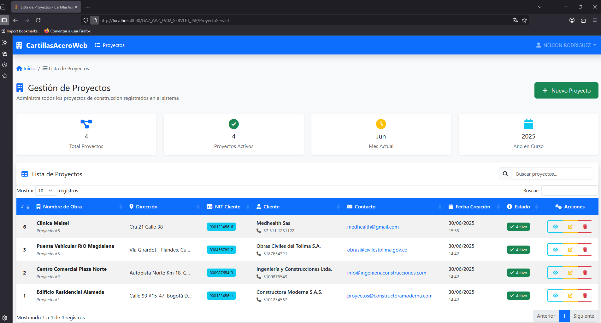
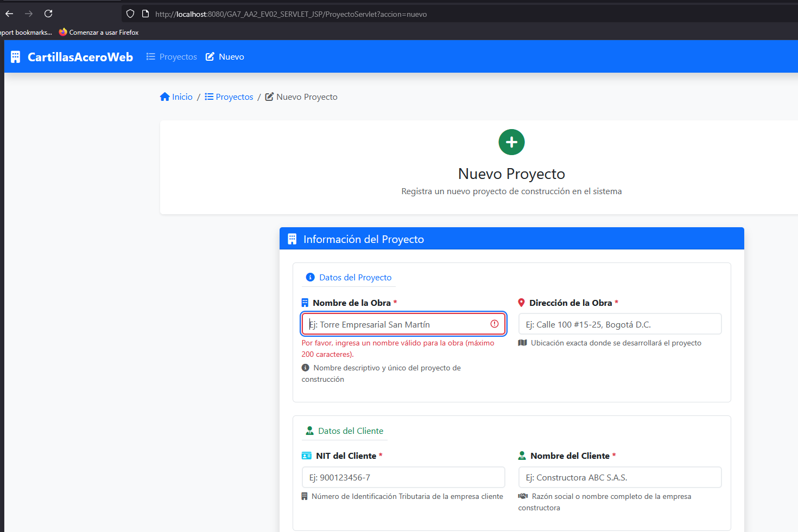
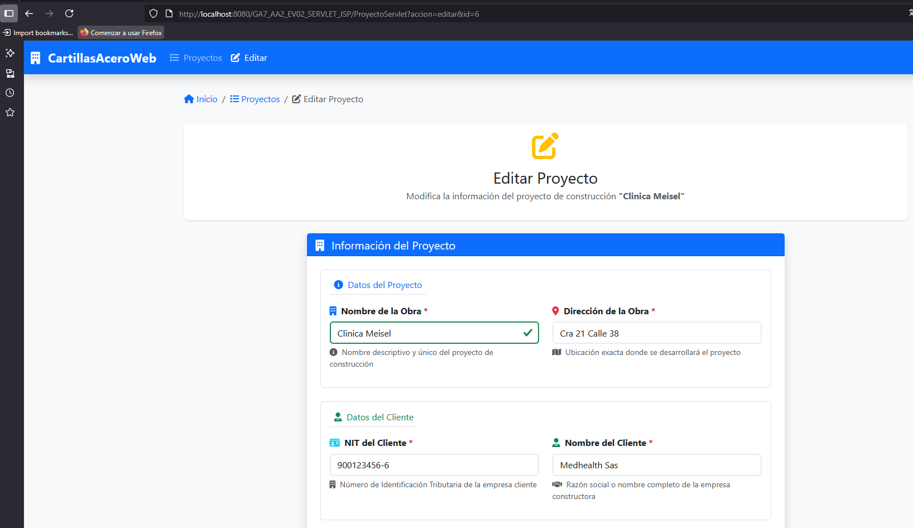
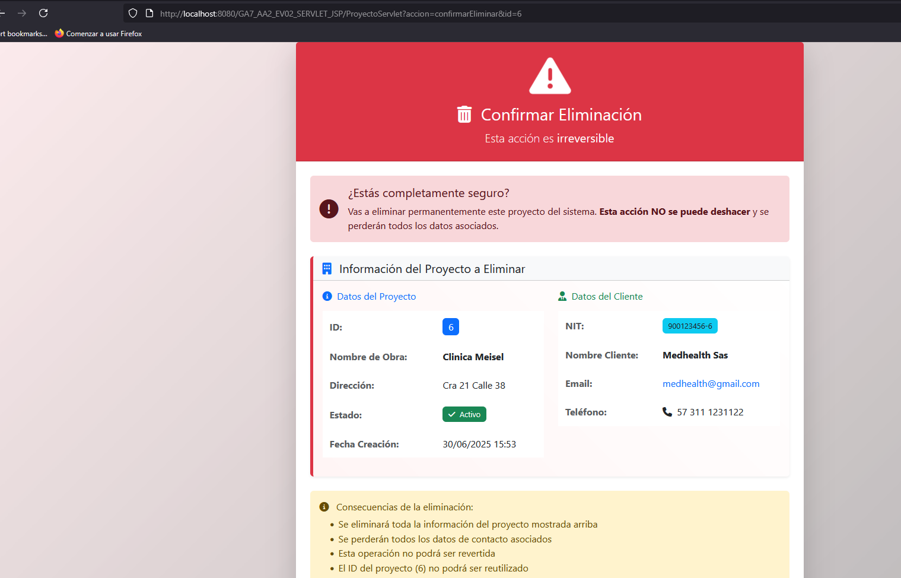
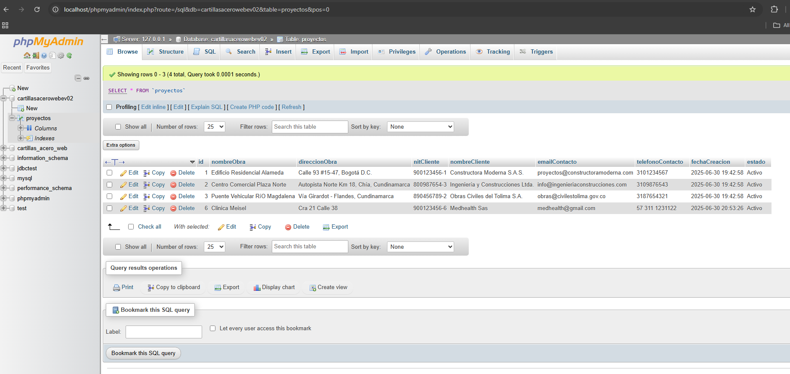

# Proyecto: CartillasAceroWeb - Módulo de Gestión de Proyectos

Este repositorio contiene el código fuente de la evidencia **GA7-220501096-AA2-EV02**, correspondiente al programa de formación en Análisis y Desarrollo de Software del SENA.

| Campo | Detalle |
|-------|---------|
| **Programa de Formación** | Análisis y Desarrollo de Software (ADSO) |
| **Proyecto Formativo** | CartillasAceroWeb: Automatización de Cartillas de Acero |
| **Evidencia** | GA7-220501096-AA2-EV02: Módulos de software codificados y probados |
| **Módulo Desarrollado** | Gestión de Proyectos (CRUD Web) |
| **Presentado por** | NELSON RODRIGUEZ SILVA |

---

## 📜 Descripción del Proyecto

**CartillasAceroWeb** es una aplicación web que implementa un sistema **CRUD completo** para gestionar proyectos de construcción. Permite crear, listar, editar y eliminar proyectos con información detallada de obras y clientes.

### ✨ Funcionalidades Principales

- ✅ **Crear Proyectos:** Formulario web con validación completa
- 📖 **Listar Proyectos:** Tabla responsive con búsqueda y filtros
- ✏️ **Editar Proyectos:** Formulario unificado con pre-carga de datos
- 🗑️ **Eliminar Proyectos:** Eliminación segura con confirmación
- 🔄 **Inicialización Automática:** Base de datos y datos de prueba

### 🚀 Tecnologías Implementadas

- **Backend:** Java 17, Jakarta EE 10, Servlets, JSP, JSTL, JDBC
- **Frontend:** HTML5, CSS3, Bootstrap 5, JavaScript
- **Base de Datos:** MySQL 8.0+
- **Servidor:** Apache Tomcat 10.1
- **Build:** Apache Maven 3.9

### 🏗️ Arquitectura MVC

- **Modelo:** `Proyecto.java` - Entidad de dominio
- **Vista:** Archivos JSP (`listaProyectos.jsp`, `formProyecto.jsp`, etc.)
- **Controlador:** `ProyectoServlet.java` - Lógica de negocio
- **DAO:** `ProyectoDAO.java` - Acceso a datos
- **Configuración:** `ConexionDB.java`, `InicializadorBD.java`

---

## 📋 Estructura del Proyecto

```
GA7_AA2_EV02_SERVLET_JSP/
├── 📁 src/main/
│   ├── 📁 java/com/mycompany/ga7_aa2_ev02_servlet_jsp/
│   │   ├── 📁 configuracion/
│   │   │   ├── 📄 ConexionDB.java           # Gestión de conexiones MySQL
│   │   │   └── 📄 InicializadorBD.java      # Inicialización automática de BD
│   │   ├── 📁 controlador/
│   │   │   └── 📄 ProyectoServlet.java      # Controlador principal (MVC)
│   │   ├── 📁 dao/
│   │   │   └── 📄 ProyectoDAO.java          # Acceso a datos (CRUD)
│   │   └── 📁 modelo/
│   │       └── 📄 Proyecto.java             # Entidad de dominio
│   └── 📁 webapp/
│       ├── 📁 css/
│       │   └── 📄 estilos.css              # Estilos personalizados
│       ├── 📁 js/
│       │   └── 📄 scripts.js               # JavaScript personalizado
│       ├── 📄 index.jsp                    # Página de inicio
│       ├── 📄 listaProyectos.jsp          # Vista lista (Read)
│       ├── 📄 formProyecto.jsp            # Vista formulario (Create/Update)
│       └── 📄 confirmarEliminar.jsp       # Vista confirmación (Delete)
├── 📄 pom.xml                             # Configuración Maven
└── 📄 README.md                           # Este archivo
```

---

## ⚙️ Instalación y Ejecución

### ✅ Prerrequisitos

**Software requerido:**
1. **Java JDK 17+** - [Descargar aquí](https://www.oracle.com/java/technologies/javase-downloads.html)
2. **Apache Maven 3.6+** - [Descargar aquí](https://maven.apache.org/download.cgi)
3. **Apache Tomcat 10.1+** - [Descargar aquí](https://tomcat.apache.org/download-10.cgi)
4. **MySQL 8.0+** - [Descargar aquí](https://dev.mysql.com/downloads/mysql/) o usar XAMPP
5. **Git** - [Descargar aquí](https://git-scm.com/downloads)

**Verificar instalación:**
```bash
java -version    # Debe mostrar Java 17+
mvn -version     # Debe mostrar Maven 3.6+
mysql --version  # Debe mostrar MySQL 8.0+
```

### 🛠️ Pasos de Configuración

#### **1. Clonar el Repositorio**
```bash
git clone [URL_DE_TU_REPOSITORIO_AQUI]
cd GA7_AA2_EV02_SERVLET_JSP
```

#### **2. Configurar MySQL**
El sistema se auto-configura con estas credenciales:
- **Usuario:** `root`
- **Contraseña:** (vacía)
- **Puerto:** `3306`

**Iniciar MySQL:**
- **XAMPP:** Abrir XAMPP Control Panel → Start MySQL
- **Instalación independiente:** Iniciar servicio MySQL

> **Nota:** Si tu MySQL tiene contraseña, editar `src/main/java/.../configuracion/ConexionDB.java` y cambiar `PASSWORD = "tu_contraseña"`

#### **3. Compilar el Proyecto**
```bash
mvn clean package
```
Esto genera el archivo `GA7_AA2_EV02_SERVLET_JSP-1.0-SNAPSHOT.war` en la carpeta `target/`

#### **4. Desplegar en Tomcat**
```bash
# Copiar WAR a Tomcat
cp target/GA7_AA2_EV02_SERVLET_JSP-1.0-SNAPSHOT.war $TOMCAT_HOME/webapps/
```

#### **5. Ejecutar la Aplicación**
```bash
# Iniciar Tomcat
# Windows: %TOMCAT_HOME%\bin\startup.bat
# Linux/macOS: $TOMCAT_HOME/bin/startup.sh
```

**Acceder a la aplicación:**
```
http://localhost:8080/GA7_AA2_EV02_SERVLET_JSP-1.0-SNAPSHOT/
```

---

## 🖼️ Demostración Visual

- **Página de Bienvenida (`index.jsp`)**  
  

- **Vista de la Lista de Proyectos**  
  

- **Formulario para Crear un Nuevo Proyecto**  
  

- **Formulario para Editar un Proyecto Existente**  
  

- **Página de Confirmación de Eliminación**  
  

- **Verificación en Base de Datos (phpMyAdmin)**  
  

---

## 🔧 Solución de Problemas

### Error de Conexión a MySQL
```bash
# Verificar que MySQL esté ejecutándose
# Revisar credenciales en ConexionDB.java
# Confirmar puerto 3306 disponible
```

### Error 404 en la aplicación
```bash
# Verificar que Tomcat esté ejecutándose
# Confirmar deployment correcto del WAR
# Revisar logs en $TOMCAT_HOME/logs/catalina.out
```

### Problemas con Maven
```bash
mvn clean  # Limpiar antes de compilar
mvn clean package -U  # Forzar actualización de dependencias
```

---

## 🎓 Información Académica

**Desarrollado por:** NELSON RODRIGUEZ SILVA  
**Código:** GA7-220501096-AA2-EV02  
**Programa:** Análisis y Desarrollo de Software - SENA  

### Competencias Demostradas
- ✅ Desarrollo de aplicaciones web con Java EE
- ✅ Implementación de arquitectura MVC
- ✅ Gestión de bases de datos con JDBC
- ✅ Desarrollo de interfaces responsive
- ✅ Validación de datos múltiples capas
- ✅ Documentación técnica completa

### Características Técnicas
- **Operaciones CRUD:** Completas y funcionales
- **Validación:** HTML5 + JavaScript + Java
- **Seguridad:** PreparedStatement (prevención SQL injection)
- **UX/UI:** Bootstrap 5, responsive design
- **Base de Datos:** Auto-inicialización con datos de prueba